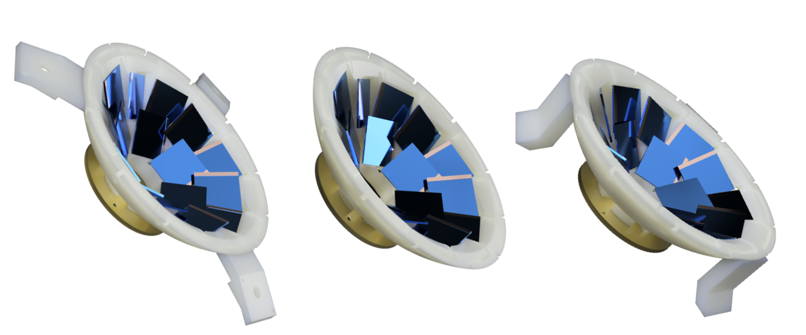

# SORCERER: solar cells for reaction experiments at ROSPHERE

SORCERER is customizable and cost-efficient particle-detection system 
for transfer experiments at ROSPHERE.
Please see the original publication in
Nuclear Instruments & Methods in Physics Research [[1]](#Bec19a).

## Introduction

For the study of low-abundant or radioactive nuclei close to the valley of stability,
(multi-) particle transfer reactions are suitable population mechanisms.
In order to distinguish between different reaction mechanisms,
an identification of recoiling particles or ejectiles is desirable.
The SORCERER array, which is designed for the use of commercial photodiodes,
is a cost-efficient particle-detection system for this purpose.

Silicon photodiodes for particle detection have, for instance,
been used for experiments with the Cologne plunger [[2]](#Klu00a) [[3]](#Dew12a)
or the TIGRESS detector array at TRIUMF [[4]](#Vos14a).
Taking this idea and combining it with rapid-prototyping techniques,
SORCERER is a versatile particle-detection system 
enabling particle-gamma coincidence studies.

## Description

Initially, SORCERER has been designed for experiments with
the ROSPHERE detector array [[5]](#Buc16a) (hence the final letter 'R' in the acronym SORCERER) 
at the “Horia Hulubei” National Institute of Physics and Nuclear Engineering (IFIN-HH)
in Bucharest, Romania.
Due to its small dimensions, the device can be used in a variety of other target chambers
either directly or with few modifications.

Currently, two versions of SORCERER exist:

- [**SORCERER_v1**](v1_6cells) with **6 photodiodes** in a single ring: 
This is the original version described in Ref. [[1]](#Bec19a).
Currently, only the CAD files for the DSAM version are available.
- [**SORCERER_v2**](v2_18cells) with **18 photodiodes** in two rings: This is an updated version
for higher solid-angle coverage. If mounted at backward angles with respect to the incident ion beam,
the usage of high-Z material for protection of the cables, 
such as [SORCERER_v2_cable_protection](v2_18cells/SORCERER_v2_cable_protection), is recommended.
It is attached to the printed body by screws of dimension M1.4x4.

Each version vX (X=1,2) contains three individual constructions;
the basic structure (`SORCERER_vX_basic_structure`) 
and its modifications for use in DSAM (`SORCERER_vX_DSAM`)
and RDDS (`SORCERER_vX_RDDS`) experiments.
The DSAM version can be used in a generic reaction chamber
while the RDDS version is designed for operation with a Cologne-type plunger.
Both share the same innermost basic structure which houses the photodiodes.
Equipping the latter with dedicated mounts, 
SORCERER can be adapted to a variety of other target chambers or use cases.

Using SORCERER, no gluing or soldering is needed to keep the photodiodes in place.
Instead, this is achieved by design using slender flaps and cable feedthroughs.
This approach guarantees a quick replacement of photodiodes.
However, this creates an intricate geometry.
It is, thus, recommended to use rapid-prototyping techniques.
Standard fused filament fabrication might not be capable of reproducing the needed level of detail.
Good experience has been made with selective fusing (laser sintering) of polyamide PA2200 [[6]](#PA2200)
in a granular bed of the same material.
The resulting structures can be used in vacua down to at least 10^-6 mbar.

## License

The hardware designs and the CAD files are distributed under the 
terms of the GNU General Public License, version 3 or later.
For details see [LICENSE](LICENSE).
You are invited to use, modify or share SORCERER.
If you used SORCERER or any modified version of it to obtain results for a publication, 
please cite the original publication [[1]](#Bec19a) and this repository.
Information on your use cases, experiences,
and ideas for future improvements are highly appreciated!

Copyright (C) 2021 Tobias Beck (tbeck@ikp.tu-darmstadt.de)

## Acknowledgements

The authors would like to thank C. Fransen for valuable advice
and the technical staff of the precision mechanical workshop 
of the Institute for Fluid Mechanics and Aerodynamics, TU Darmstadt 
for production of all mounting structures presented here.

This work was supported by the BMBF under grant Nos. 05P18RDEN9 and 05P18RDFN1/9, 
the Romanian Ministry of Research and Innovation under contract No. PN 19060102, 
and the European Union within the Horizon 2020 research and innovation programme (ENSAR-2).

## References

<a name='Bec19a'>[1]</a> T. Beck *et al.*, Nucl. Instrum. Methods Phys. Res. A **951**, 163090 (2020). [`doi:10.1016/j.nima.2019.163090`](https://doi.org/10.1016/j.nima.2019.163090).\
<a name='Klu00a'>[2]</a> T. Klug *et al.*, Phys. Lett. B **495**, 55 (2000). [`doi:10.1016/S0370-2693(00)01233-8`](https://doi.org/10.1016/S0370-2693(00)01233-8).\
<a name='Dew12a'>[3]</a> A. Dewald, O. Möller, and P. Petkov, Prog. Part. Nucl. Phys. **67**, 786 (2012). [`doi:10.1016/j.ppnp.2012.03.003`](https://doi.org/10.1016/j.ppnp.2012.03.003).\
<a name='Vos14a'>[4]</a> P. Voss *et al.*, Nucl. Instrum. Methods Phys. Res. A **746**, 87 (2014). [`doi:10.1016/j.nima.2014.02.006`](https://doi.org/10.1016/j.nima.2014.02.006).\
<a name='Buc16a'>[5]</a> D. Bucurescu *et al.*, Nucl. Instrum. Methods Phys. Res. A **837**, 1 (2016). [`doi:10.1016/j.nima.2016.08.052`](https://doi.org/10.1016/j.nima.2016.08.052).\
<a name='PA2200'>[6]</a> Product information PA2200 (in German). [`https://www.wehl-partner.de/images/stories/Materialdaten/lasersintern/laser-sinter-pa2200_product_information_de.pdf`](https://www.wehl-partner.de/images/stories/Materialdaten/lasersintern/laser-sinter-pa2200_product_information_de.pdf).

